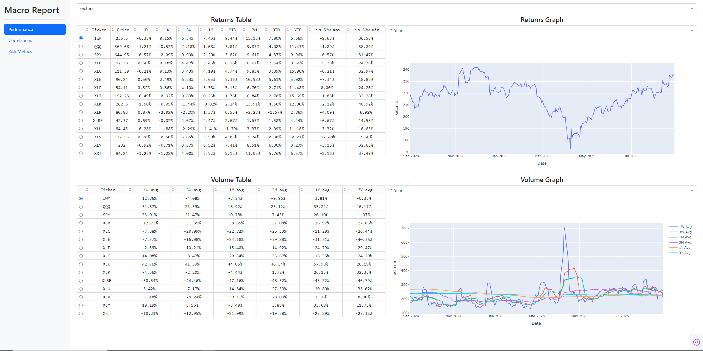

# Macro Report

A fast, daily dashboard for macro markets — performance, cross-asset correlations, and rates/spreads — built with Dash + Plotly and backed by a lightweight SQLite store.

---

## What

**Macro Report** centralizes day-over-day changes across major asset classes and puts them in context:
- **Performance** across many tickers and groups, over multiple horizons.
- **Correlations** for a chosen asset vs. others at 15D/30D/90D/120D/180D windows (plus 1y 30D highs/lows).
- **Risk metrics** from FRED (rates & credit spreads) for a quick macro read.

Data is persisted in a local SQLite database so the app stays snappy and resilient.

## Why

Macro decisions live at the intersection of **trend**, **correlation**, and **cost of capital**. This project aims to:
- Give a **single place** to scan broad performance.
- Show when **diversification breaks down** (rolling correlations by horizon).
- Track **macro drivers** (rates, breakevens, credit spreads) without context-switching.

---

## Features (with screenshots)

### 1) Performance
- Returns table: 1D / 1W / 3W / 1M / MTD / 3M / QTD / YTD, plus distance to 52w high/low.
- Returns graph for the selected asset with lookbacks (1m–all).
- Volume table vs. rolling averages (1W…3Y) and a volume chart with rolling curves.



### 2) Correlations
- Rolling Pearson correlations of the selected ticker vs. others at **15D, 30D, 90D, 120D, 180D**.
- 1-year **30D high/low** markers for quick regime context.
- Multi-panel correlation chart (recent window) to visualize stability/instability.


### 3) Risk Metrics
- Pulls FRED series like **2s10s**, **5Y breakevens**, **HY OAS**, **IG OAS**, **UST 3M/2Y/5Y/10Y/30Y**.
- Table of changes vs. 1D/1W/1M/3M and distance to 52w extremes & long-run averages.
- Single-series chart with selectable lookbacks.


---

## Getting Started

### Prerequisites
- Python **3.10+**
- Interactive Brokers **TWS/Gateway** running locally with API enabled (default host `127.0.0.1`, port `7496`) and appropriate market data permissions (app defaults to delayed data if available).
- CSV lists of tickers under `res/tickers/` and correlation universe under `res/tickers_corr/correlations_etfs.csv`.

### Install
```bash
git clone https://github.com/your-username/Macro-Report.git
cd Macro-Report

python -m venv venv
# Windows: venv\Scripts\activate
# macOS/Linux:
source venv/bin/activate

pip install -r requirements.txt
```

### Seed / Update the Local Database (optional but recommended)
This will fetch historical prices (via IB) for all tickers discovered in `res/tickers/` and `res/tickers_corr/` and write them to SQLite.
```bash
python data_fetcher.py
```

**Storage:** By default the app uses **`data/macro_report.db`** (see `src/services.py`).

### Run the App (dev)
```bash
python main.py
```
Then open: `http://localhost:5000`

### Docker (optional)
A `docker-compose.yml` is included to run the web app and the data fetcher as services.
```bash
docker compose up --build
```

#### Configuration (env vars)
Tweak IB pacing and connectivity without touching code (see `src/stock_data_service.py`):
- `IB_HIST_CONCURRENCY` – worker count (default: 4)
- `IB_HIST_RETRIES` – per-ticker retries (default: 3)
- `IB_HIST_TIMEOUT_SEC` – request timeout (default: 60)
- `IB_HIST_MAX_REQS` / `IB_HIST_WINDOW_SEC` – rate limit window (default: 60 reqs / 600s)

---

## How it works (short)

- **App/UI**: Dash + Plotly (`src/app.py`, `src/layout.py`, `src/calculations.py`)
- **Data layer**: `src/stock_data_service.py` fetches via `ib_insync`; FRED via `pandas_datareader`.
- **Database**: `src/database_client.py` writes/reads OHLCV to **SQLite** (`data/macro_report.db`).
- **Batch updates**: `data_fetcher.py` streams tickers through a paced async pipeline to respect IB limits.

---

## Roadmap

- Correlation **history chart per pair** across all horizons (15–180D) with hoverable regime markers.
- Add **FX & crypto** coverage, with proper contract mapping for IB.
- Export **CSV/PNG** from tables and charts.
- **Caching**/memoization for heavy views; faster cold-starts.
- **Tests** for calculations + data access; CI gates.
- Optional **alerts** (email/Slack) for threshold breaches (e.g., corr > 0.8 / < -0.8, 52w extremes).
- Add **Positioning** tab (CFTC) and **Volatility** tab (term-structure & surface snapshots).

---

## License

Released under the **MIT License**. See `LICENSE` (or include the text below if not present).

```
MIT License

Copyright (c) 2025 Macro Report contributors

Permission is hereby granted, free of charge, to any person obtaining a copy
of this software and associated documentation files (the "Software"), to deal
in the Software without restriction, including without limitation the rights
to use, copy, modify, merge, publish, distribute, sublicense, and/or sell
copies of the Software, and to permit persons to whom the Software is
furnished to do so, subject to the following conditions:

[...truncated for brevity; add full MIT text here or include a LICENSE file...]
```

---

### Notes
- Correlation universe and groupings are controlled by the CSVs under `res/`.
- FX CSV entries are automatically transformed to `=X` tickers for Yahoo-style symbols but are **skipped** for IB historical fetches by design (see `_is_fetchable_by_ib`).
